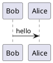

# PlantUMLEncoderPlugin

This Structurizr DSL plugin looks for inline PlantUML diagram definitions in Markdown/AsciiDoc documentation,
and encodes them as images. For example, this definition in Markdown content:



Will be converted to:

```

```

Which renders as:


## Usage

Add the plugin, and reference it from your DSL file as follows:

```
!plugin com.structurizr.dsl.plugins.plantuml.PlantUMLEncoderPlugin
```

This should appear after any `!docs` and/or `!adrs` statements that import documentation into your workspace.